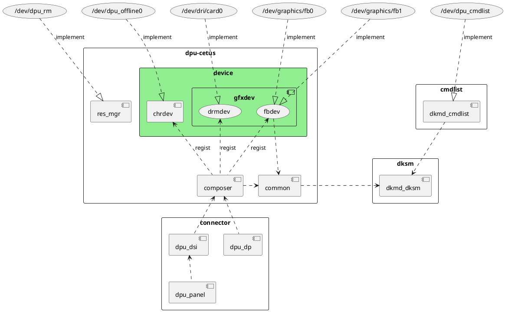
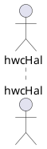
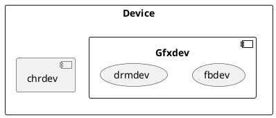
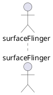
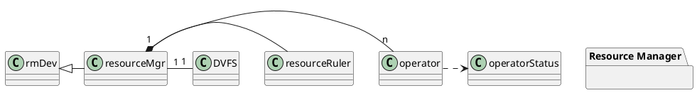

# DKMD系统软件设计说明书
## 修订记录
|  日期     |修订版本|   修改章节   |修改描述| 作者              |
|  ----    | ----   |    ----     | ----  |---                  |
| 2021-02-18 | V0.1   | 建立模板 | 初稿   | 00274020 |

- [DKMD系统软件设计说明书](#dkmd系统软件设计说明书)
  - [修订记录](#修订记录)
  - [1 简介](#1-简介)
  - [2 第零层设计描述](#2-第零层设计描述)
    - [2.1 软件系统上下文定义](#21-软件系统上下文定义)
    - [2.2 软件系统主要用例](#22-软件系统主要用例)
  - [3 第一层设计描述](#3-第一层设计描述)
    - [3.1 总体结构](#31-总体结构)
    - [3.2 组件/子系统1分解描述](#32-组件子系统1分解描述)
      - [3.2.1 组件/子系统1主要功能概述](#321-组件子系统1主要功能概述)
      - [3.2.2 组件/子系统1模块分解](#322-组件子系统1模块分解)
        - [3.2.2.1 Device模块](#3221-device模块)
      - [3.2.3 组件/子系统1与其他层的接口](#323-组件子系统1与其他层的接口)
      - [3.2.3.1 外部的接口描述](#3231-外部的接口描述)
      - [3.2.3.2 内核层的接口描述](#3232-内核层的接口描述)
    - [3.3 组件/子系统2-内核层分解描述](#33-组件子系统2-内核层分解描述)
      - [3.3.1 组件/子系统2 -内核层的主要功能概述](#331-组件子系统2--内核层的主要功能概述)
      - [3.3.2 组件/子系统2 -内核层的模块分解](#332-组件子系统2--内核层的模块分解)
      - [3.3.3 组件/子系统2 -内核层与其他层的接口](#333-组件子系统2--内核层与其他层的接口)
  - [4 模块/子系统1-HAL层详细设计](#4-模块子系统1-hal层详细设计)
    - [4.1 UML类图](#41-uml类图)
    - [4.2 接口](#42-接口)
  - [5 模块2-内核层详细设计](#5-模块2-内核层详细设计)
    - [5.1 UML类图](#51-uml类图)

## 1 简介
这是DKMD软件系统的设计说明书，软件的简介如下：

将驱动模块化后，他们的依赖关系如上图所示。

## 2 第零层设计描述
### 2.1 软件系统上下文定义
软件系统的上下文图，明确输入和输出，以及与其他系统的接口。

### 2.2 软件系统主要用例
这里输入系统的主要用例

```plantuml
  '系统关键用例
  @startuml
    left to right direction
    '外部输入actor
    actor  hwcHal
  @enduml
```

## 3 第一层设计描述
### 3.1 总体结构
这里要描述软件系统的总体结构（包括资源/内存分配，Flash资源/文件分配，配置）。总体结构描述可以使用结构图，层次分解图，数据流图，自然语言。
第一层设计包括了DDD领域驱动设计中的子域的划分和组件component两个层次的工作，目的是把系统细化到组件这一级别。

### 3.2 组件/子系统1分解描述
组件/子系统1的描述，功能，设计。
#### 3.2.1 组件/子系统1主要功能概述
HAL层主要完成与硬件无关部分的逻辑操作，包括生成送显网络，生成刷写寄存器的cmdLsit等。包括两个模块：
- networkGenerator：完成送显网络的生成和cmdList内容的生成
- displayManager：调度底层displayDrv驱动读取cmdList.

#### 3.2.2 组件/子系统1模块分解
##### 3.2.2.1 Device模块
1. Device模块的活动图如下：

2. xxx 模块的时序图如下：

#### 3.2.3 组件/子系统1与其他层的接口
#### 3.2.3.1 外部的接口描述
#### 3.2.3.2 内核层的接口描述

### 3.3 组件/子系统2-内核层分解描述
组件/子系统2的描述，功能，设计
#### 3.3.1 组件/子系统2 -内核层的主要功能概述
#### 3.3.2 组件/子系统2 -内核层的模块分解
#### 3.3.3 组件/子系统2 -内核层与其他层的接口

## 4 模块/子系统1-HAL层详细设计
描述模块/子系统1的详细的设计，包括这个模块/子系统包括哪些模块？
### 4.1 UML类图
模块1的UML类图

### 4.2 接口

## 5 模块2-内核层详细设计
### 5.1 UML类图